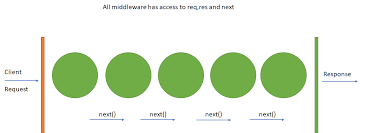
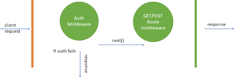

# **Node**

## **What is Node?**
- Node is a event Driven, I/O driven
  - Whenever there is an event node giving it to the event loop means anything which is a I/O or event-driven request goes to the event loop.
- Node is single threaded so we cannot write blocking code in the main thread we write it in the event loop
- Node is async (i.e we can handle many things without waiting for it)
- Node is non-blocking (i.e we write code that does not block others)
- Node is built on top of V8 engine
- Node is a cross-platform runtime environment for building highly scalable server-side applications using JavaScript.

## **Event loop**
- An event loop is something that pulls stuff out of the queue and places it onto the function execution stack whenever the function stack becomes empty.
- The event loop is the secret by which JavaScript gives us an illusion of being multithreaded even though it is single-threaded. 
- It has 6 phase
  1. **Timer** => Anything you write as a timer it will run in this phase
  2. **Pending callback** => errors/callback is handle here
  3. **Idle** => nothing is done or planning something
  4. **Pole phase** => main activities happen / event loop spend max amount of time 
  5. **Check phase** => If we want to do something immediately / run something which is immediately (example: medical emergency, door bell, phonecall  )
  6. **Close callback/phase** => any event which is open it is close in here/ memory allocation destroy 
- nexttick
  - It has microtask queue 
  - Binding of js and c++ 
  - It is not a part of event loop but it is attached to it
  - Its runs the code in blocking way, sometime we have to wait then we use nexttick

## **NPM & NVM**
- **NPM** 
  - Its stands for Node Package Manager
  - npm is the command line client that allows developers to install and publish those packages.

- **NVM** 
  - Its stands for Node Version Manager. 
  - As the name suggests, it helps you manage and switch between different Node versions with ease.

|commands|description|
|---|---|
|nvm install stable| install the current stable version of node i.e v16.10.0|
|nvm ls |  list all the versions downloaded|
|nvm install (version-number) | install any version|
|nvm use (version-number) | use any downloaded version|
|nvm alias default (version-number) | change the default version|

- **Package.json**
  - It records the minimum version your app needs.
  - If you update the versions of a particular package, the change is not going to be reflected here.
    - dependencies => It consist of all the require modules use in application, and if the modules is not install then application will crash
    - devDependencies => It consist of all the development dependencies, and this modules is not the compulsory requirement to start the application
 
- **Package-lock.json**
  - NPM will look into package-lock.json and install exact versions of the package as the owner has installed so it will ignore the ^ and ~ from package.json.
    - ~version => “Approximately equivalent to version”, will update you to all future patch versions, without incrementing the minor version. Example: ~1.2.3 will use releases from 1.2.3 to <1.3.0
    - ^version => “Compatible with version”, will update you to all future minor/patch versions, without incrementing the major version. Example: ~2.3.4 will use releases from 2.3.4 to <3.0.0

- **npm install**
  - Whenever we perform npm install, package-lock.json and node_modules are created  
    - In parent directory, if package.json is present only in parent directory, 
    - If not in the parent directory, then will search for package.json in one directory up and this will continue till the home directory and package-lock.json and node_modules will be created there.
    - If package.json is not found, then package-lock.json and node_modules are created in the current project directory.

## **Core module in node(fs, path)**

### File System
- This is one of the important modules of node.js. It is used to do file operations
- As it is a core module so we don’t need to install it, we just have to directly require it
```javascript
const fs = require('fs')
```
- Now fs variable holds the reference of what exported from fs module.So we can use all methods of fs module from fs variable now
- Fs module have both synchronous and asynchronous methods have,whenever we do any file operation before the application starts, then it’s ok to use Sync methods, but once the app starts running all operation after it should be Async, otherwise it will block main thread
- There are two methods to readfile, one is readFile and other is readFileSync
readFile is Asynchronous, it runs via eventloop, it is non blocking
readFileSync is Synchronous, it runs on call stack, it is blocking
- Now question come when to use readFile and when to use readFileSync
- So we have any static files, which is available to us already, then we can read it via readFileSync, before app starts, as it is ok to have blocking code before app start
- But we are reading any dynamic file, or after application starts then use readFile method,so this I/O operation don’t block main thread

Commonly used methods of fs module
- **readFile**: read file
- **writeFile**: write given data in file.If the file already exists then it overwrites that file, else it creates a new file.
- **Rename**: rename file
- **readDir**: read the contents of directory
- **rm**: remove file or directory
- **stat**: tells information of file or directory
- **unlink**: remove file


### Path
- The path module is the core module of node.js.
- It is used to handle paths
- As it is a core module so we don’t need to install it, we can just require it.

Commonly used methods of path module
- **join**: It takes sequence of paths and then join all the paths using platform specific delimiter and the normalizes the resulting path
- **resolve**: It take sequence of paths and then resolve them into absolute path

## **Middleware**

Middleware functions are functions that have access to the request object (req), the response object (res), and the next function in the application’s request-response cycle. The next function is a function in the Express router which, when invoked, executes the middleware succeeding the current middleware.

Middleware functions can perform the following tasks:
- Execute any code.
- Make changes to the request and the response objects.
- End the request-response cycle based on some condition.
- Call the next middleware in the stack.

If the current middleware function does not end the request-response cycle, it must call **next()** to pass control to the next middleware function. Otherwise, the request will be left hanging.







Types of express middleware
- Application level middleware => app.use
- Router level middleware => router.use
- Built-in middleware => express.static,express.json,express.urlencoded
- Error handling middleware => app.use(err,req,res,next)
- Third Party middleware => bodyparser,cookieparser

## **require()**
- Node.js follows the CommonJS module system, and the builtin require function is the easiest way to include modules that exist in separate files.
- The basic functionality of require is that it reads a Javascript file, executes the file, and then proceeds to return the exports object.
- Require always need to be at the top of the file because it is a blocking code
- If we use 2 require of the same type then it will only run first and ignore 2nd require.
- It basically act as a bridge which connect each file of program to make full working application

Example
- If we run `const example = require(‘./example.js’)` then `example.js` will get executed

## **module.exports**


If we want to export some module from certain file we constantly need to tell node “Hey node, I want to export this module/function” so to do this we need to use module.exports
- If we want to export only one function use this method
```javascript
function add(v1, v2){
  return v1+v2;
}

module.exports = add
```
```javascript
const addOperation = require('./operation');
console.log(addOperation(1, 2));
```

- If we want to export more than one function we can do these using 2 ways
  - 1st method
  ```javascript
  function add(v1, v2){
    return v1+v2;
  }

  function subtract(v1, v2){
    return v1-v2;
  }
  module.exports = {
    add, 
    subtract
  }
  ```
  ```javascript
  const operation = require('./operation');
  console.log(operation.add(1, 2));
  console.log(operation.subtract(10, 2));
  ```

  - 2nd method
  ```javascript
  function add(v1, v2){
    return v1+v2;
  }

  function subtract(v1, v2){
    return v1-v2;
  }
  module.exports.add = add;
  module.exports.subtract = subtract;

  ```

There is also shortcut created for this module.export so we can directly use exports because inside node exports is pointing/reference to module.export
  - `var exports = module.exports`

```javascript
function add(v1, v2){
  return v1+v2;
}
exports.add = add;
```
In above case if we try to use 
```javascript
exports = add;
```
This will throw and TypeError when we try to invoke add function as it change the reference of exports from module.exports to add 

## **Do & Don’t**
- require() should always be at the top of program
- Router should always contain non-blocking code
- Don’t hard code your port on which server is running.
- Do check the license type and weekly downloads before using any npm package.
- Don’t write any dynamic routes before writing static routes with the same path.
- Do not directly switch to major version of any package, there's a chance that application will break
- const variable name is always in uppercase with “_” so that developer can easily identify its type
- File name should be in small with “-” separated
- Load time => we can write blocking code during application is loading
- Run time => always try to write non-blocking code
- make sure that before any static route, there shouldn’t be any dynamic route which matches it.
- Use .env file to store credential 
- if else (statement) is preferred over to ternary (expression) - (for readability purpose)
- When writing promise, it is better to use safe promise function to consume promise
- While selecting npm package check license, last publish, weekly publish.
- Keep the code consistent.
- There should not be any hardcoded path.
- There should not be any hard coded variable, use .env variable.

